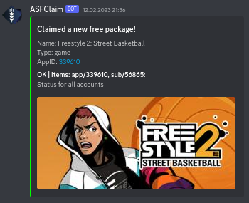
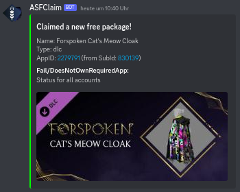
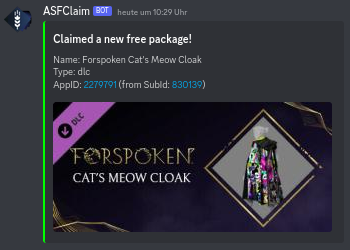
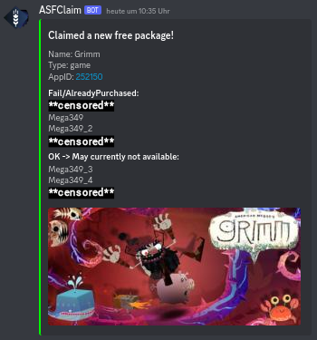

# ASFclaim

[DockerHub Repository](https://hub.docker.com/r/journeyover/asfclaim) | Forked from [C4illin/ASFclaim](https://github.com/C4illin/ASFclaim)

ASFclaim is a tool designed to automatically claim new free packages on [Steam](https://store.steampowered.com/) when available, working in conjunction with [ArchiSteamFarm](https://github.com/JustArchiNET/ArchiSteamFarm) (ASF) with IPC enabled.

---

## Optional: Discord Webhook Integration

Use the optional webhook integration to receive claim notifications on Discord.

### Notification Types

#### **Successfully Claimed Game**
  

#### **Claimed Package Containing a DLC (with or without status visibility)**
  
  

#### **Claimed Game Package with Multiple Results and Visible Botnames**
  

When `WEBHOOK_SHOWACCOUNTSTATUS` is set to `false`, bot names and statuses remain hidden—ideal for public channels.

## Installation

### Baremetal Prerequisites
1. Enable IPC in [ASF](https://github.com/JustArchiNET/ArchiSteamFarm/wiki/IPC) (add password to `.env` if not empty).
2. Install Node.js (v18 or later).

### Manual Installation

```bash
# Clone the repository
git clone https://github.com/JourneyDocker/ASFclaim.git

# Navigate to directory
cd ASFclaim

# Install dependencies
npm install

# Start the application
node .
```

### Docker Installation

#### Quick Start with Docker

```sh
docker run --name asfclaim \
  -e TZ=America/Chicago \
  -e ASF_PROTOCOL=http \
  -e ASF_HOST=localhost \
  -e ASF_PORT=1242 \
  -e ASF_PASS=secret \
  -e ASF_COMMAND_PREFIX=! \
  -e ASF_BOTS=asf \
  -e ASF_CLAIM_INTERVAL=6 \
  -e WEBHOOK_URL=none \
  -e WEBHOOK_ENABLEDTYPES=error;warn;success \
  -e WEBHOOK_SHOWACCOUNTSTATUS=true \
  journeyover/asfclaim:latest
```

#### Docker Compose

Create a `docker-compose.yml`:

```yaml
volumes:
    data:

services:
    asfclaim:
        image: journeyover/asfclaim:latest
        environment:
            - TZ=America/Chicago
            - ASF_PROTOCOL=http
            - ASF_HOST=localhost
            - ASF_PORT=1242
            - ASF_PASS=secret
            - ASF_COMMAND_PREFIX="!"
            - ASF_BOTS=asf
            - ASF_CLAIM_INTERVAL=6
            - WEBHOOK_URL=none  # Replace with your Discord Webhook URL
            - WEBHOOK_ENABLEDTYPES=error;warn;success  # 'info' might be too verbose
            - WEBHOOK_SHOWACCOUNTSTATUS=true  # Set to 'false' to hide bot names in Discord
        volumes:
            - data:/app/storage/
```

## Environment Variables

| ENV                         | Description                                  | Info                                                   | Default Value                        | Required |
|-----------------------------|----------------------------------------------|--------------------------------------------------------|--------------------------------------|----------|
| `TZ`                        | Your timezone                                | Timezone identifier (e.g., `Europe/Amsterdam`)         | `America/Chicago`                   | No       |
| `ASF_PROTOCOL`              | ASF IPC Transfer protocol                    | Options: `http` or `https`                             | `http`                               | No       |
| `ASF_HOST`                  | ASF IPC Hostname or IP                       | Hostname or IP address                                 | `localhost`                          | No       |
| `ASF_PORT`                  | ASF IPC Port                                 | Port number for IPC                                    | `1242`                               | No       |
| `ASF_PASS`                  | ASF IPC Password                             | Plaintext password for ASF                             | `secret`                             | No       |
| `ASF_COMMAND_PREFIX`        | Command prefix for ASF                       | Prefix used before commands                            | `!`                                  | No       |
| `ASF_BOTS`                  | List of ASF bot names                        | Comma-separated bot names                              | `asf`                                | No       |
| `ASF_CLAIM_INTERVAL`        | Hours to wait for execution                  | Interval in hours between checks                       | `6`                                  | No       |
| `GIST_ID`                   | Gist ID containing Steam codes               | GitHub Gist ID for fetching codes                      | `e8c5cf365d816f2640242bf01d8d3675`   | No       |
| `WEBHOOK_URL`               | Discord Webhook URL                          | URL for Discord webhook or `none` to disable           | `none`                               | No       |
| `WEBHOOK_ENABLEDTYPES`      | Displayed notification types in Discord chat | Semicolon-separated types (e.g., `error;warn;success`) | `error;warn;success`                 | No       |
| `WEBHOOK_SHOWACCOUNTSTATUS` | Show result from ASF                         | Options: `true` or `false`                             | `true`                               | No       |

---

## External Resources

- Webhook Bot Icon: [ASF GitHub](https://raw.githubusercontent.com/JustArchiNET/ArchiSteamFarm/main/resources/ASF_512x512.png)
- Webhook Placeholder Image: [placeholder.com](https://via.placeholder.com/460x215.jpg?text=Cant+load+image)
- Claimable Package List: [GitHub: C4illin's Gist](https://gist.github.com/C4illin/e8c5cf365d816f2640242bf01d8d3675) | [Github: JourneyOver's Gist](https://gist.github.com/JourneyOver/590fefa34af75a961a85ff392ebc0932)
- Steam API
